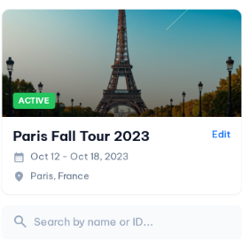
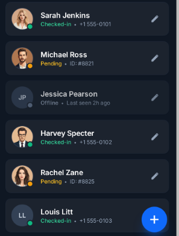

# People Page: Implementation Plan

## Summary
When a user logs in with the `tour-admin` role, the app should show the new `People` page instead of the current `Itinerary` page. This document outlines the implementation steps, file targets, acceptance criteria, UI notes (based on attached screenshots), and testing checklist.

## Design references
The UI mockups used for visual guidance are attached as image references below. Add the actual image files to this folder or update paths as needed.

- 
- 

---

## Goals
- Add a new `People` screen that lists people in the tour (avatars, name, status tag, phone/ID, edit action).
- Ensure `tour-admin` users are redirected to `People` immediately after login and wherever the app would normally default to `Itinerary`.
- Keep the implementation minimal, testable, and easy to extend.

---

## Implementation Steps (high level)
1. Create the `People` screen component
   - File: `src/features/people/PeopleScreen.tsx`
   - Responsibilities: render a list, handle pull-to-refresh, show placeholder/empty state.
   - UI: follow the attached people-list screenshots (status dot, avatar, name, small meta line, edit icon, floating `+` button).

2. Register the route
   - File: `src/navigation/index.tsx`
   - Add a route named `People` to the navigator used as the app's main stack/tab.

3. Change post-login redirect for `tour-admin`
   - Files to check: `src/context/AppContext.tsx` or any login handler/component that performs navigation after auth.
   - Behavior: after successful login, if `user.role === 'tour-admin'` navigate to `People` instead of `Itinerary`.

4. Ensure initial/default route respects role
   - Search for places where the initial/default landing or persisted last-screen is set; ensure `tour-admin` maps to `People`.

5. Data fetching
   - Hook the `People` screen to fetch list data from backend endpoints (e.g., `touristRoutes` or `tourGroup` endpoints in backend) or reuse existing services in `src/services/`.
   - Provide a mock-data fallback via `src/utils/mockData.ts` for offline / dev.

6. Styling & accessibility
   - Implement accessible touch targets, readable colors, and proper labels.
   - Add a floating action button to create/add people tied to existing flows if present.

7. Tests & QA
   - Unit test login redirect behavior (role-based navigation).
   - Basic snapshot/UI test for `PeopleScreen` (if project uses Jest/React Native Testing Library).
   - Manual QA: verify redirect, list loading, empty state, and edit action.

8. Docs & PR
   - Add this plan (`docs/people-page-plan.md`).
   - Commit with clear messages and open PR describing UX change.

---

## File-level Implementation Notes
- `src/features/people/PeopleScreen.tsx` (new)
  - Use the app's existing UI primitives (paper theme, cards, list items) to match style.
  - Component signature: `function PeopleScreen({ navigation, route })`.

- `src/navigation/index.tsx`
  - Add:
    - import: `PeopleScreen` from the new file.
    - route registration: `<Stack.Screen name="People" component={PeopleScreen} />` (or equivalent for tab navigator).

- Auth / login redirect
  - If authentication state is managed in `src/context/AppContext.tsx`, add logic immediately after successful auth to: `if (user.role === 'tour-admin') navigation.reset({ index: 0, routes: [{ name: 'People' }] })`.

---

## Acceptance Criteria
- After logging in as a user with `role: 'tour-admin'`, the first screen shown is `People` (not `Itinerary`).
- Non-`tour-admin` users see existing behavior unchanged.
- `People` list displays entries with avatar, name, small meta (ID/phone), status badge (checked-in/pending/offline), and an edit icon.
- Data loads from backend or shows a friendly empty state when no data.

---

## Estimated Effort
- Screen scaffold + styling: 3–5 hours
- Navigation + redirect wiring: 1–2 hours
- Data fetching + error states: 2–3 hours
- Tests & QA: 1–2 hours
- Total: ~1 day of focused work

---

## Testing Checklist
- [ ] Login as `tour-admin` → lands on `People` screen
- [ ] Login as normal user → lands on previous default (e.g., `Itinerary`)
- [ ] `People` screen loads list from API and displays statuses
- [ ] Pull-to-refresh works
- [ ] Edit action opens expected edit flow
- [ ] Accessibility: elements have accessibility labels

---

If you'd like, I can implement step 1 (create the screen scaffold) now and open a PR-ready commit. Tell me if you prefer a simple list first or a full-fidelity UI matching the screenshots.
